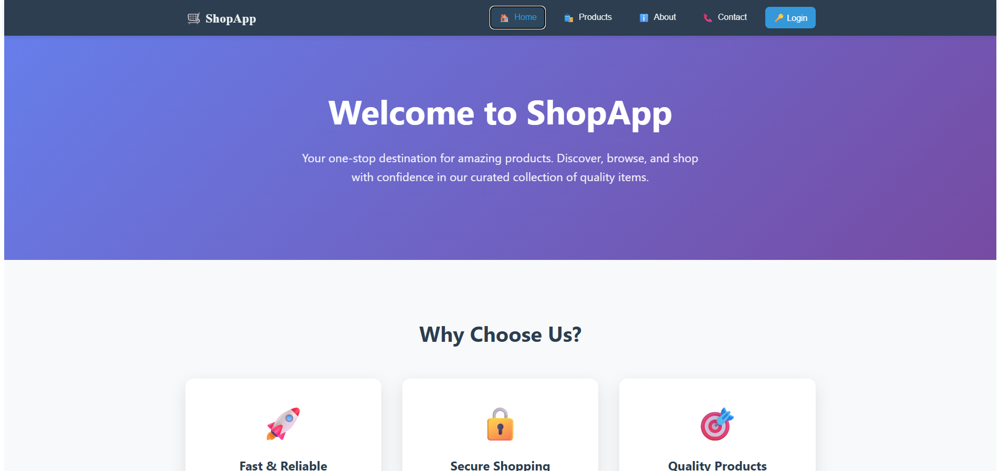
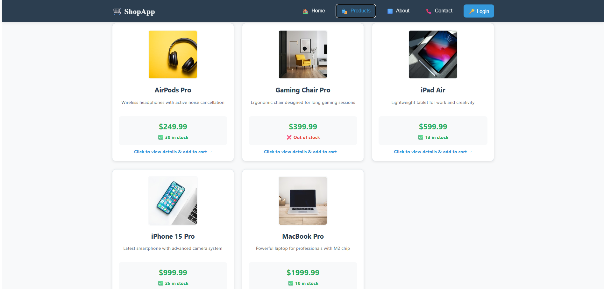
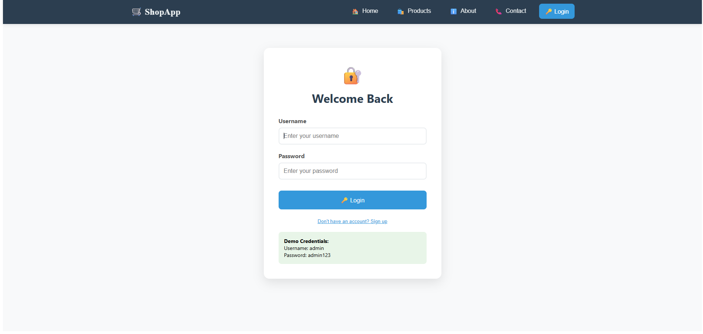
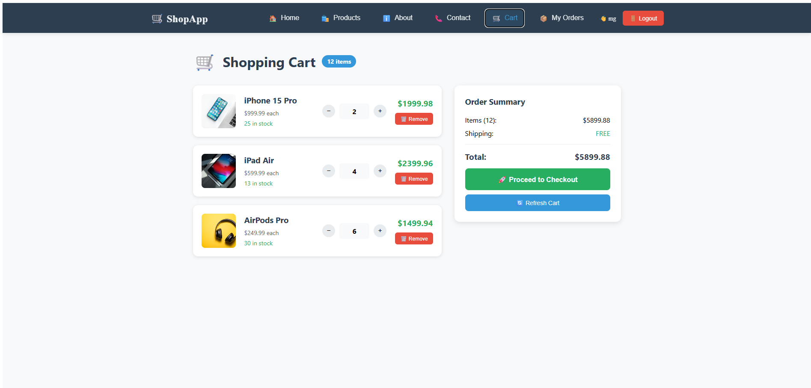
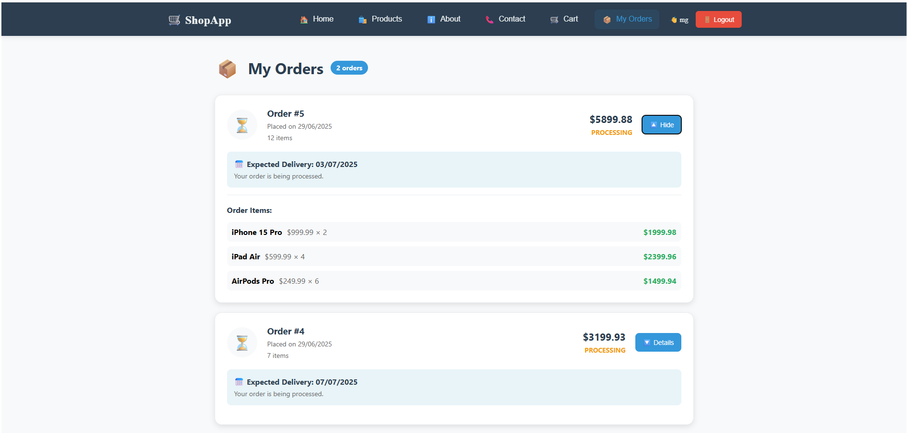

# ShopApp - Full-Stack E-commerce Application

## Overview
ShopApp is a complete e-commerce web application that provides a comprehensive shopping experience with user authentication, product management, shopping cart functionality, and order processing. The application is built using a Node.js/Express backend with SQLite database and a React TypeScript frontend.

## Screenshots

### Home Page

*Beautiful landing page with modern design and navigation*

### Products Catalog

*Browse products with detailed information, pricing, and add-to-cart functionality*

### Login/Register Page

*Secure authentication system with user registration and login forms*

### Shopping Cart

*Interactive cart with quantity controls, real-time totals, and checkout process*

### My Orders Page

*Order history with delivery tracking and detailed order information*

## Project Structure
```
my-fullstack-app
├── backend
│   ├── src
│   │   ├── api
│   │   │   └── endpoint.ts          # API endpoints for all features
│   │   ├── database
│   │   │   └── schema.ts            # SQLite database schema
│   │   ├── middleware
│   │   │   └── auth.ts              # JWT authentication middleware
│   │   ├── services
│   │   │   ├── AuthService.ts       # Authentication logic
│   │   │   ├── CartService.ts       # Shopping cart management
│   │   │   ├── OrderService.ts      # Order processing
│   │   │   └── ProductService.ts    # Product management
│   │   └── app.ts                   # Express server setup
│   ├── package.json
│   └── tsconfig.json
├── frontend
│   ├── src
│   │   ├── components
│   │   │   ├── AboutPage.tsx        # About us page
│   │   │   ├── AdminPage.tsx        # Admin product management
│   │   │   ├── CartPage.tsx         # Shopping cart interface
│   │   │   ├── ContactPage.tsx      # Contact form
│   │   │   ├── HomePage.tsx         # Landing page
│   │   │   ├── LoginPage.tsx        # Login/Register forms
│   │   │   ├── Navigation.tsx       # Navigation bar
│   │   │   ├── OrdersPage.tsx       # Order history
│   │   │   └── View.tsx             # Product catalog
│   │   ├── contexts
│   │   │   └── AuthContext.tsx      # Authentication context
│   │   ├── App.tsx                  # Main application component
│   │   └── index.tsx                # React entry point
│   ├── package.json
│   └── tsconfig.json
└── README.md
```

## Features

### 🔐 Authentication System
- User registration and login
- JWT-based authentication
- Role-based access control (Admin/User)
- Protected routes and middleware

### 🛍️ Product Management
- Browse product catalog with detailed information
- Admin panel for adding/managing products
- Product images, descriptions, and pricing
- Stock quantity tracking

### 🛒 Shopping Cart
- Add products to cart
- Update quantities
- Remove items
- Real-time cart total calculation
- Persistent cart data

### 📦 Order Processing
- Complete checkout process
- Order confirmation with details
- Order history tracking
- Delivery date estimation
- Order status updates (Pending, Processing, Shipped, Delivered)

### 🎨 User Interface
- Responsive design for all devices
- Beautiful and intuitive interface
- Loading states and error handling
- Modern React components with TypeScript

## Technology Stack

### Backend
- **Node.js** with **Express.js**
- **TypeScript** for type safety
- **SQLite** database with custom schema
- **JWT** for authentication
- **bcrypt** for password hashing

### Frontend
- **React 17** with **TypeScript**
- **Custom CSS-in-JS** styling
- **Context API** for state management
- **Functional components** with hooks

## Setup Instructions

### Prerequisites
- Node.js (v14 or higher)
- npm or yarn package manager

### Backend Setup
1. Navigate to the `backend` directory:
   ```bash
   cd backend
   ```

2. Install dependencies:
   ```bash
   npm install
   ```

3. Start the server:
   ```bash
   npm start
   ```
   The backend will run on `http://localhost:3000`

### Frontend Setup
1. Navigate to the `frontend` directory:
   ```bash
   cd frontend
   ```

2. Install dependencies:
   ```bash
   npm install
   ```

3. Start the frontend application:
   ```bash
   npm start
   ```
   The frontend will run on `http://localhost:3001`

## API Endpoints

### Authentication
- **POST /api/auth/login** - User login
- **POST /api/auth/register** - User registration

### Products
- **GET /api/products** - Get all products
- **GET /api/products/:id** - Get product by ID
- **POST /api/products** - Create new product (Admin only)
- **PUT /api/products/:id** - Update product (Admin only)
- **DELETE /api/products/:id** - Delete product (Admin only)

### Shopping Cart
- **GET /api/cart** - Get user's cart
- **POST /api/cart** - Add item to cart
- **PUT /api/cart/:id** - Update cart item quantity
- **DELETE /api/cart/:id** - Remove item from cart

### Orders
- **GET /api/orders** - Get user's order history
- **GET /api/orders/:id** - Get specific order details
- **POST /api/orders** - Create new order (checkout)

## Default Admin Credentials
```
Username: admin
Password: admin123
```

## Usage Guide

### For Users:
1. **Register/Login** - Create an account or login with existing credentials
2. **Browse Products** - View available products in the catalog
3. **Add to Cart** - Add desired items to your shopping cart
4. **Checkout** - Complete the purchase process
5. **View Orders** - Track your order history and delivery status

### For Administrators:
1. **Login** with admin credentials
2. **Access Admin Panel** - Manage product inventory
3. **Add Products** - Create new products with details and pricing
4. **Monitor Orders** - View all customer orders (if implemented)

## Database Schema

### Users Table
- id, username, email, password_hash, role, created_at

### Products Table
- id, name, description, price, stock, image_url, is_active, created_at

### Cart Items Table
- id, user_id, product_id, quantity, created_at

### Orders Table
- id, user_id, total_amount, status, delivery_date, created_at

### Order Items Table
- id, order_id, product_id, product_name, product_price, quantity, subtotal

## Development Notes

### Security Features
- Password hashing with bcrypt
- JWT token authentication
- Protected API endpoints
- Input validation and sanitization

### Error Handling
- Comprehensive error messages
- Graceful failure handling
- Loading states for better UX

### Performance Considerations
- Efficient database queries
- Optimized React components
- Proper state management


## Future Enhancements
- Payment gateway integration (Stripe, PayPal)
- Email notifications for orders
- Product reviews and ratings
- Advanced search and filtering
- Real-time order tracking
- Mobile app development
- Admin dashboard with analytics
- Multi-language support
- Wishlist functionality

## Troubleshooting

### Common Issues
1. **Port conflicts** - Make sure ports 3000 and 3001 are available
2. **Database issues** - Delete `database.sqlite` to reset the database
3. **Node version** - Ensure you're using Node.js v14 or higher
4. **Input fields not working** - Clear browser cache and hard refresh
5. **CORS errors** - Backend and frontend must run on different ports

### Development Tips
- Use browser developer tools for debugging
- Check console logs for error messages
- Verify API responses with tools like Postman
- Clear browser cache if experiencing UI issues

## Acceptance Criteria
- ✅ User authentication system with JWT
- ✅ Product catalog with CRUD operations
- ✅ Shopping cart functionality
- ✅ Order processing and history
- ✅ Admin panel for product management
- ✅ Responsive design for all devices
- ✅ Error handling and loading states
- ✅ Secure API endpoints with authentication

## Definition of Done
- ✅ All features implemented and tested
- ✅ Code reviewed and documented
- ✅ Database schema optimized
- ✅ Security measures implemented
- ✅ User interface polished and responsive
- ✅ API endpoints fully functional
- ✅ Documentation complete and up to date

## License
This project is licensed under the ISC License.

## Contributing
1. Fork the repository
2. Create a feature branch
3. Commit your changes
4. Push to the branch
5. Create a Pull Request
